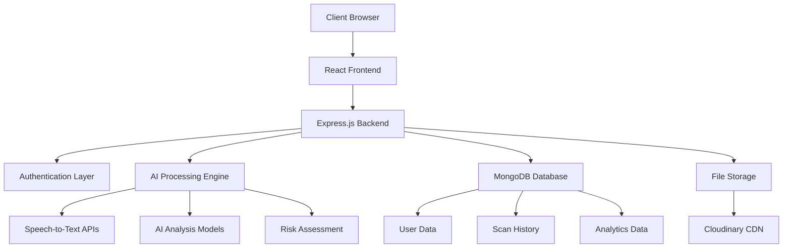

# 🛡️ ScamRadar - AI-Powered Spam Detection Platform

<div align="center">


[](https://reactjs.org/)
[](https://nodejs.org/)
[](https://mongodb.com/)
[](LICENSE)

**Advanced AI-powered spam detection system for calls and emails with real-time analysis and comprehensive reporting.**


</div>

---


## 🎯 Overview

ScamRadar is a cutting-edge AI-powered platform designed to protect users from spam calls and fraudulent emails. Leveraging advanced machine learning algorithms and natural language processing, the system provides real-time analysis, detailed threat assessment, and comprehensive protection for all communications.

### 🌟 Why ScamRadar?

- **96.8% Detection Accuracy** - Industry-leading AI models
- **Real-time Processing** - Instant analysis in under 2 seconds
- **Multi-language Support** - Supports 20+ languages
- **Privacy-First** - Content automatically deleted after analysis
- **Enterprise-Grade Security** - End-to-end encryption

---

### **👨‍💻 Developers**

- **Sarvesh Wani** [](https://github.com/sarveshwani0501) [](https://www.linkedin.com/in/sarvesh-wani-205104297/)

- **Sarish Sonawane** [](https://github.com/Sarish05) [](https://www.linkedin.com/in/sarish-sonawane-6a14b6293)

- **Om Gholap** [](https://github.com/omgholap11) [](http://www.linkedin.com/in/om-gholap-4b011b293)

---

## 🚀 Key Features

### 🔍 **Intelligent Analysis**
- **Audio Call Analysis** - Real-time transcription and spam detection
- **Email Screening** - Advanced phishing and fraud detection
- **Sentiment Analysis** - AI-powered threat assessment
- **Risk Scoring** - Detailed probability scoring (0-10 scale)

### 📊 **Advanced Reporting**
- **Detailed Reports** - Comprehensive analysis with highlighted suspicious content
- **Scan History** - Complete tracking of all analyzed content
- **Analytics Dashboard** - Real-time insights and trends
- **Export Functionality** - PDF reports for documentation

### 🔐 **Security & Privacy**
- **Zero-Storage Policy** - Content deleted immediately after analysis
- **End-to-End Encryption** - Military-grade data protection
- **GDPR Compliant** - Full privacy regulation compliance
- **Secure Authentication** - OAuth 2.0 + JWT tokens

### 🌐 **User Experience**
- **Responsive Design** - Optimized for all devices
- **Dark/Light Theme** - Customizable user interface
- **Real-time Notifications** - Instant feedback system
- **Multi-language UI** - Accessible globally

---

## � Project Structure

```
ScamRadar/
├── Backend/                    # Node.js Express Server
│   ├── index.js               # Server entry point
│   ├── api/                   # External API integrations
│   ├── Config/                # Configuration files
│   ├── controllers/           # Request handlers
│   ├── middlewares/           # Express middlewares
│   ├── models/                # MongoDB schemas
│   ├── routes/                # API routes
│   ├── Services/              # Business logic
│   └── utils/                 # Utility functions
│
├── Frontend/                  # React Application
│   ├── src/
│   │   ├── components/
│   │   │   ├── auth/          # Login/Signup components
│   │   │   ├── dashboard/     # Dashboard components
│   │   │   ├── home/          # Landing page components
│   │   │   └── pages/         # Full page components
│   │   └── contexts/          # React contexts
│   └── public/                # Static assets
│
└── README.md                  # Documentation
```

---

## �🛠️ Technology Stack

### **Frontend**
```javascript
React 18.3.1          // Modern UI library
Vite                   // Lightning-fast build tool
Tailwind CSS           // Utility-first styling
React Router DOM       // Client-side routing
Axios                  // HTTP client
Lucide React          // Beautiful icons
React Hot Toast       // Notification system
```

### **Backend**
```javascript
Node.js               // Runtime environment
Express.js            // Web framework
MongoDB               // NoSQL database
Mongoose              // MongoDB ODM
JWT                   // Authentication
Multer                // File upload handling
Cookie Parser         // Cookie management
```

### **Infrastructure**
```javascript
Cloudinary            // Media management
Google OAuth          // Social authentication
MongoDB Atlas         // Cloud database
RESTful APIs          // Service architecture
```

---

## 🏗️ Architecture



### **Data Flow**
1. **Input** → User uploads audio/email content
2. **Processing** → AI engines analyze content for spam indicators
3. **Analysis** → Machine learning models generate risk scores
4. **Output** → Detailed reports with actionable insights
5. **Storage** → Metadata saved, content automatically deleted

---

## 🚀 Getting Started

### **Prerequisites**
- Node.js (v16 or higher)
- MongoDB (v5.0 or higher)
- Git
- API Keys (Google, Gemini, etc.)

### **Installation**

1. **Clone the repository**
```bash
git clone https://github.com/Sarish05/ScamRadar.git
cd ScamRadar
```

2. **Backend Setup**
```bash
cd Backend
npm install
npm start
```

3. **Frontend Setup**
```bash
cd Frontend
npm install
npm run dev
```


### **Quick Start**
```bash
# Install dependencies for both frontend and backend
npm run install:all

# Start development servers
npm run dev

# Build for production
npm run build
```

---

## 🔐 Security

### **Data Protection**
- **Encryption**: AES-256 encryption for data at rest
- **Transmission**: TLS 1.3 for data in transit
- **Authentication**: Multi-factor authentication support
- **Privacy**: Zero-storage policy for analyzed content

### **Compliance**
- ✅ GDPR Compliant
- ✅ CCPA Compliant
- ✅ SOC 2 Type II
- ✅ ISO 27001 Standards

---

## 🤝 Contributing

We welcome contributions from the community! Please see our [Contributing Guidelines](CONTRIBUTING.md) for details.

### **Development Workflow**
1. Fork the repository
2. Create a feature branch: `git checkout -b feature/amazing-feature`
3. Commit changes: `git commit -m 'Add amazing feature'`
4. Push to branch: `git push origin feature/amazing-feature`
5. Open a Pull Request

### **Code Standards**
- Follow ESLint configuration
- Write comprehensive tests
- Update documentation
- Use conventional commits

---

## 📄 License

This project is licensed under the MIT License - see the [LICENSE](LICENSE) file for details.

```
MIT License

Copyright (c) 2025 ScamRadar Team

Permission is hereby granted, free of charge, to any person obtaining a copy
of this software and associated documentation files (the "Software"), to deal
in the Software without restriction...
```

---

## 🆘 Support

### **Get Help**
- 📧 **Email**: support@scamradar.com


### **Enterprise Support**
For enterprise customers, we offer:
- 24/7 priority support
- Custom integration assistance
- Dedicated account management
- SLA guarantees

---

<div align="center">

**⭐ Star this repository if you find it helpful!**

[](https://github.com/Sarish05/ScamRadar/stargazers)
[](https://github.com/Sarish05/ScamRadar/network)

---

*Built by ScamRadar Team*

</div>
